  

  ◈ AI • ML • GEN AI • COMPUTER VISION • BUILDING WHAT'S NEXT ◈

<!-- 

  <a href="https://github.com/HasnatKhan010">
    <picture>
      <source media="(prefers-color-scheme: dark)" srcset="dark.svg">
      
    </picture>
  </a>

 -->

 

  
  &nbsp;
  
  &nbsp;
  
  &nbsp;
  
  &nbsp;
  

 

### ▌ Verified Competencies

|                                        Certification                                       |                                                  Issuing Authority                                                 |                     Focus                     |
| :----------------------------------------------------------------------------------------: | :----------------------------------------------------------------------------------------------------------------: | :-------------------------------------------: |
|  [**Crash Course on Python**](https://coursera.org/share/5b3e7663548a9325ce49906c8e4893fe) |  | Data Structures & Algorithmic Problem Solving |
| [**Mathematics for ML & DS**](https://coursera.org/share/cad9f1738a338e286bd97213512ec307) |            |     Linear Algebra, Calculus, Probability     |
|     [**Machine Learning**](https://coursera.org/share/7bccd0956f698ef5027a2768c5152714)    |           |       Model Deployment & Neural Networks      |
|    [**ACT AI — Competency & Tools**](https://actai.aiskillbridge.pk/v/YAVFR8KV2JRXEF2L)    |              |            Artificial Intelligence            |

---

 

  

